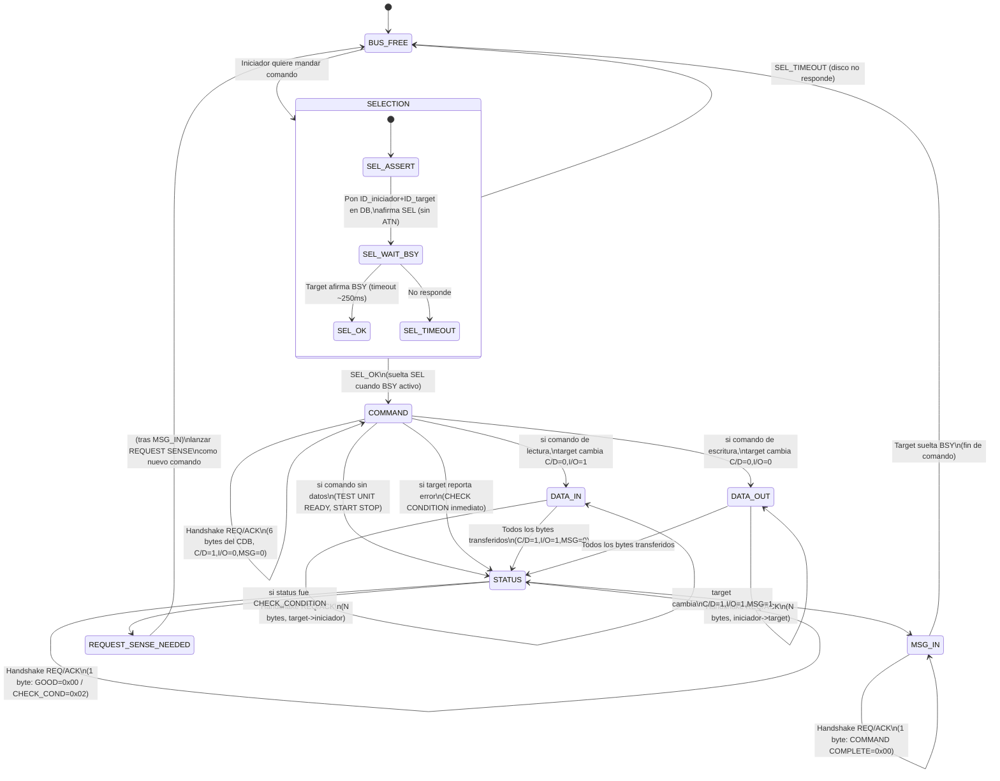
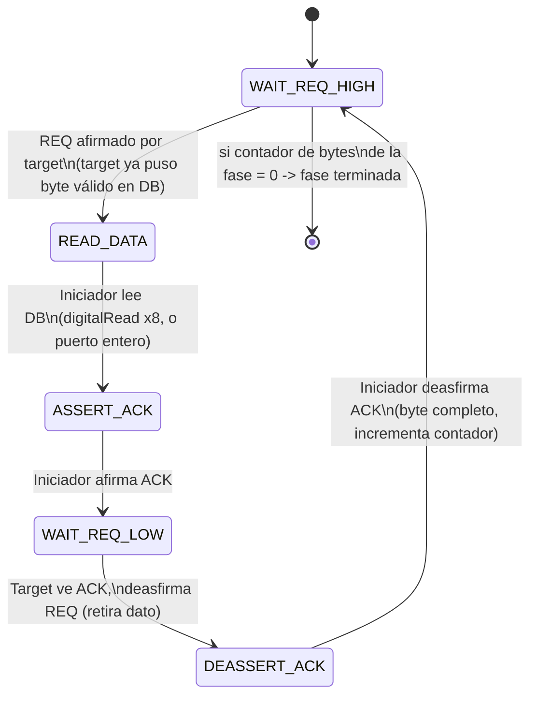
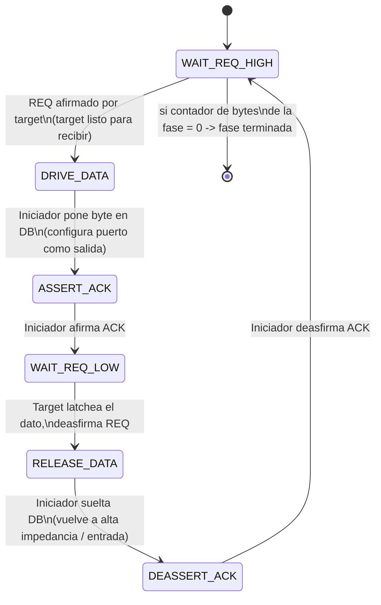

# Máquina de estados SCSI-1 para bitbanging (iniciador único, sin ATN)

## 1. Fases del bus (nivel alto)

El iniciador reconoce la fase leyendo las líneas **C/D, I/O, MSG** que el
target pone estables justo antes/durante REQ. No hay arbitraje porque eres
el único iniciador en el bus.



**Notas clave:**
- Sin ATN afirmado en SELECTION, el target no espera MESSAGE OUT (te ahorras esa fase).
- El iniciador **nunca decide la fase**: solo la lee de C/D/I-O/MSG y actúa en consecuencia. Si el firmware ve una fase inesperada, debe abortar (soltar el bus, hacer RST si hace falta).
- `REQUEST_SENSE_NEEDED`: tras cualquier `CHECK CONDITION`, el siguiente comando *debe* ser `REQUEST SENSE` o el disco se queda "atascado" en esa condición de error.

---

## 2. Handshake REQ/ACK (el que se ejecuta por cada byte, en cualquier fase)

Es un protocolo **asíncrono** — no hay reloj, todo se sincroniza a mano con
REQ/ACK. Es idéntico en estructura para las 4 fases de transferencia
(COMMAND, DATA, STATUS, MESSAGE IN); solo cambia quién conduce el bus de
datos.

### 2a. Target → Iniciador (DATA IN, STATUS, MESSAGE IN)



### 2b. Iniciador → Target (COMMAND, DATA OUT)



**Timing crítico a respetar en el bitbang (SCSI-1 async, cable corto):**
- Data setup time antes de ACK: ≥ 90 ns (en la práctica, con GPIO de 8 bits a través de un pin-change, ni lo notarás — el cuello de botella real es tu velocidad de toggling de pines).
- Bus settle / skew entre líneas de datos: ≥ 10 ns.
- Ninguno de estos plazos es alcanzable "por accidente" en un micro de 8 bits a decenas de MHz sin cuidado — en la práctica te sobra margen, el problema real suele ser la *capacitancia del cable* si no usas buffers (74LS641 o similar) entre el micro y el bus SCSI de 5V.

---

## 3. Pseudocódigo del bucle central

```c
uint8_t scsi_handshake_in(void) {           // target -> iniciador
    while (!REQ_asserted());                 // espera REQ
    uint8_t byte = read_data_bus();
    ACK_assert();
    while (REQ_asserted());                  // espera a que target suelte REQ
    ACK_deassert();
    return byte;
}

void scsi_handshake_out(uint8_t byte) {      // iniciador -> target
    while (!REQ_asserted());
    drive_data_bus(byte);
    ACK_assert();
    while (REQ_asserted());
    release_data_bus();
    ACK_deassert();
}
```

Con estas dos funciones (`scsi_handshake_in` / `scsi_handshake_out`) y la
máquina de fases de arriba, ya tienes toda la lógica de bajo nivel que
necesita READ(6)/WRITE(6)/STATUS/MESSAGE — cada fase es solo "llamar N
veces a la función correcta".
